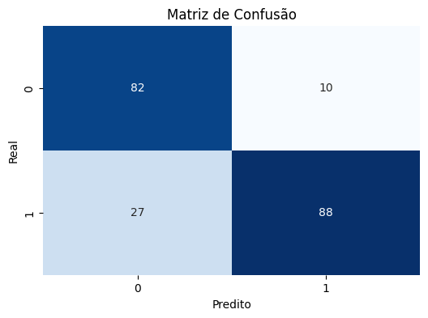

# Uso do LDA para prever se o crédito deve ser aprovado ou não

O dataset Credit Approval contém dados de clientes (variáveis financeiras, demográficas, etc.) e a tarefa é prever se o crédito deve ser aprovado ou não (target binário: aprova +/ reprova -).

## Dataset

O dataset usado foi o credit approval da UCI Machine Learning Repository, para usá-lo instalei o ``ucimlrepo``, com o comando: ``pip install ucimlrepo`` e importei ``from ucimlrepo import fetch_ucirepo``.

O dataset refere-se a solicitações de cartão de crédito.  Todos os nomes e valores de atributos foram alterados para símbolos sem sentido para proteger a confidencialidade dos dados.

## Matriz de Confusão

